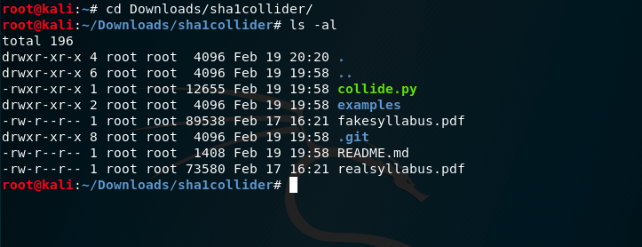
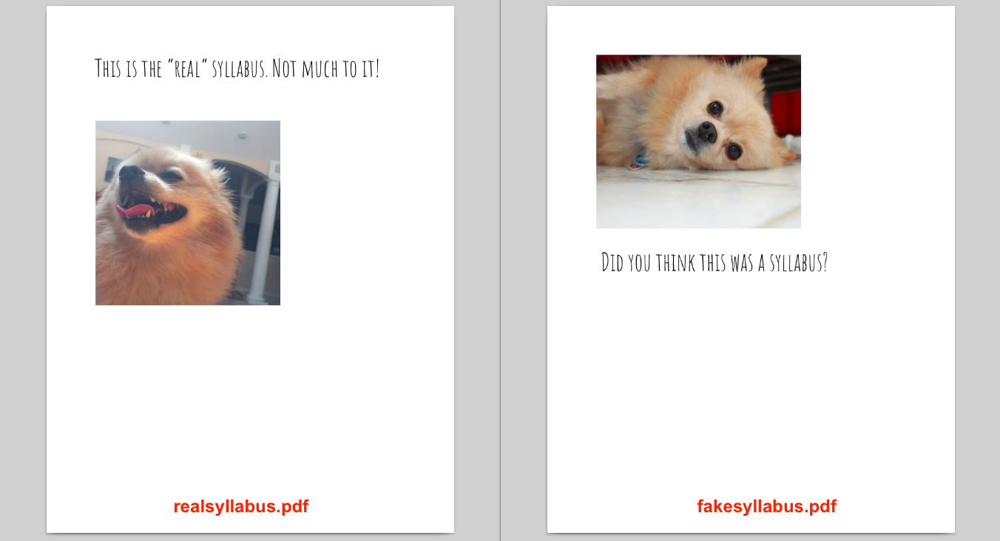
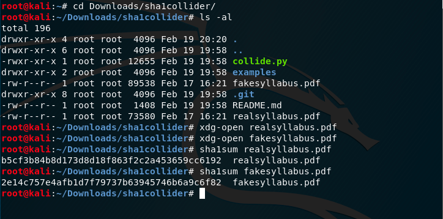
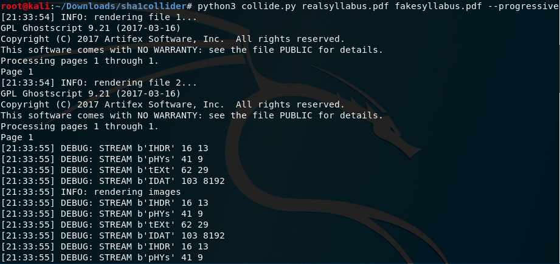
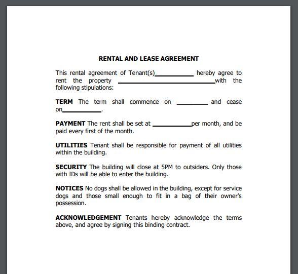

# Hands-on-SHA1-Collisions-Using-sha1collider


Welcome to the SHA-1 collision creation exercise. In order to gain the most out of this exercise, you are expected to know what a cryptographic hash function is and have a basic understanding about what they are used for. An initial understanding of how SHA-1 works is preferred but not required (you can find an overview of both cryptographic hash functions and SHA-1 in the Introduction section).

Please setup the lab environment as directed in the ```Lab Setup Directions``` section.
During the exercise, please follow instructions carefully and think about what they do.
Type the commands yourself- copy and paste will not work properly.
If you run into trouble or have questions, let us know.

---

### 0. Lab Setup Directions

Download and install [VirtualBox](https://www.virtualbox.org/wiki/Downloads) (version 5.1.28, please!).


Download the following [Kali-attacker VM](http://plato.cs.virginia.edu/ibrahim/vms/Kali-Attacker.ova) - size: 7.82GB - which we will refer to as the attacker machine.

Kali-Attacker.ova md5 checksum: c86c5a68bfbb2b9002d3909710d46800
<br>
Kali-Attacker.ova sha1 checksum: 2d0da6f07d289309b0ccc0ec6de4b2c9f620ea13

---

### 1. Introduction

Cryptographic hash functions compress messages of arbitrary length into an output
of short, fixed length. This output, referred to as its digest, is used to cross check
the input data's identity by comparing it to a known digest for that data. If a hash
function is secure and meets all requirements to be considered a cryptographic hash
function, its output should be unique for any given input. Moreover, small variations
in the input should produce a distinguishable difference in its message digest.

An important distinction to address is the difference between encryption algorithms and cryptographic hash functions.
Encryption algorithms seek to hide messages from those the message was not directed towards, and requires no data to be lost during the alteration of the message.
The message must be changed in such a way that the receiver can decrypt it and see its contents.
Cryptographic hash functions, on the other hand, explicitly lose data during its process.
This is done to facilitate a quicker speed at which the identity of data can be confirmed.
Therefore, cryptographic hash functions are considered one-way functions;
one is unable to decipher the contents of the hashed message from the output alone.

##### The SHA-1 Hash Function

The SHA-1 hash function is a member of the SHA family of hash functions and was create in 1995 as part of the U.S. Government's Capstone project. SHA-1 takes an arbitrary input and produces a 160-bit message digest, or hash. This hash can be used as the file's ``fingerprint" for testing the authenticity of the data within. This hash function was found to be insecure in 2005, but has been used in recent years for certificate authentication and checksums of files.

In 2017, Stevens et al. crafted the first ever practical SHA-1 collision between two PDF files. The type of collision they created was a fixed prefix collision: A collision created by having identical starts of files, followed by distinct, slight differences in a small amount of the files, which is where the collision appears. After the collision is created, all that follows in both files (i.e. the suffixes of the files) must be identical.

However, their collision was strategically placed to take advantage of a special property of the JPEG images in the PDFs: JPEG comments. JPEG comments are blocks of file data which are ignored by PDF viewers, as they are meant as metadata for the images rather than rendering information. Therefore, in the special blocks where their collision took place, they assigned different starting and end points of these comment fields for each file. This meant that while both files have the "data" for both PDFs embedded in their files, each renders a different image, depending on which image their JPEG comment length hides, as shown in Figure 1 below. 


Notice that most PDFs have their important information about what it contains and its image properties at the end of the file.
Pointers to the end of the file are located throughout the PDF to grab information about its contents.
Therefore, using the same identical prefixes and collision blocks as the researchers in 2017 did, we are able to generate our own colliding PDFs, as long as our own PDFs can fit into the JPEG comment lengths they originally created.

Obviously, this attack only works for PDFs- their headers are locked in place, so operating systems will always recognize them as PDFs. You might be asking, ``Why can't we just craft our own collisions?", but while it is true that SHA-1 is broken and it is possible to create our own collisions, we do not have the resources to perform the attack from scratch in a reasonable amount of time. Their work costed ~\$100,000 to perform, along with taking the equivalent of 100 GPU years of work-- costs that, although feasible for corporations, governments and some hacking groups, would not be feasible for university students. Luckily, we can leverage the work already done to create countless PDF collisions!


### 2. SHA-1 Collision Creation

In this section, you will use the SHA-1 collision creator (using the ```sha1collider``` tool created by GitHub user ```nneonneo```, available [here](https://github.com/nneonneo/sha1collider), to check the two PDFs found in the virtual machine) on two PDFs given to you, followed by two PDFs which you manipulate. 

#### 2.1 Inspecting Two Different PDFs

Perform the following actions:

1. On the attacker machine (Kali), open the terminal and go to the ```sha1collider``` directory in the ```Downloads``` directory, by typing: <br><br>
	```cd Downloads/sha1collider/```<br><br>

2. Inspect the content of the ```sha1collider``` directory, shown in the figure below, by typing:<br><br>
	```ls -al```<br><br>
<br><br>

3. Note the size of the ```realsyllabus.pdf``` file on a sheet of paper.<br><br>

4. Note the size of the ```fakesyllabus.pdf``` file on a sheet of paper.<br><br>

5. To view the content of the ```realsyllabus.pdf``` file, type:<br><br>
	```xdg-open realsyllabus.pdf```<br><br>

6. To view the content of the ```fakesyllabus.pdf``` file, type: <br><br>
	```xdg-open fakesyllabus.pdf```<br><br>
	<br><br>

7. Now, check the SHA-1 checksums of both PDFs by running the following commands: <br><br>
	```sha1sum realsyllabus.pdf``` <br><br>
	and <br><br>
	```sha1sum fakesyllabus.pdf```<br><br>
	<br><br>


> <span style="color:red">Q1. Are the SHA1SUM values different?</span>

#### 2.2 Generate your SHA-1 Colliding PDFs}

You will now use the ```collide.py``` script to generate TWO pdf files which correspond to ```realsyllabus.pdf``` and ```fakesyllabus.pdf``` but have the SAME sha1sum value. Before you proceed, feel free to inspect the ```collide.py``` script using your favorite editor.

> Note: The explanation of the \texttt{collide.py} script is out of the scope of this document.<br><br>

1. Start the collision generation for the ```realsyllabus.pdf``` and ```fakesyllabus.pdf``` in order to generate the two files called ```out-realsyllabus.pdf``` and ```out-fakesyllabus.pdf``` which have the same sha1sum value, by running:<br><br>
	```python3 collide.py realsyllabus.pdf fakesyllabus.pdf --progressive```<br><br>
Note: This process will keep running for some time. Don't interrupt the process until it finishes execution.<br><br>
<br><br>

2. View the content of the ```out-realsyllabus.pdf``` file by typing:<br><br>
	```xdg-open out-realsyllabus.pdf```<br><br>

3. View the content of the ```out-fakesyllabus.pdf``` file by typing:<br><br>
	```xdg-open out-fakesyllabus.pdf```<br><br>
> <span style="color:red">Q2. Is the content in either file different?</span>

4. Check the *size* of the output files, which should be named ```out-realsyllabus.pdf``` and ```out-fakesyllabus.pdf```, by typing:<br><br>
	```ls -al```<br><br>

5. Note the \textbf{size} of \texttt{out-realsyllabus.pdf} and \texttt{out-fakesyllabus.pdf} files on a sheet of paper. <br><br>
> <span style="color:red">Q3. Are the size values different?</span>

6. Check the SHA-1 hashes of the two new files by running the following commands:<br><br>
```sha1sum out-realsyllabus.pdf```<br><br>
and<br><br>
```sha1sum out-fakesyllabus.pdf```<br><br>
> <span style="color:red">Q4. Are the SHA1SUM values different?</span>
<br><br>

#### 2.3 Generate Your Own SHA-1 Collision

Now, you will create your own distinct contracts using our template. Then, you will run the collision generating program on them. 


1. Download the contract template shown in the figure below, using this link:  http://plato.cs.virginia.edu/ibrahim/shared/compid-lease.docx <br><br>
<br><br>


2. Open the template using your favorite .docx editor (or in Google Docs) and fill in the blank portions with your own terms. <br><br>

3. Export this modified version as ```<your computing id>-lease-1.pdf``` <br><br>

4. Open the template AGAIN using your favorite .docx editor (or in Google Docs) and EDIT the terms you entered in step 2.<br><br>

5. Export this modified version as ```<your computing id>-lease-2.pdf``` <br><br>

6. Copy both PDF leases to the Kali VM.<br><br>

7. View the content of the ```<your computing id>-lease-1.pdf``` file by typing:<br><br>
	```xdg-open <your computing id>-lease-1.pdf```<br><br>

8. View the content of the \texttt{<your computing id>-lease-2.pdf} file by typing:<br><br>
	```xdg-open <your computing id>-lease-2.pdf```<br><br>

9. Check the SHA-1 hashes of the two new files by running the following commands:<br><br>
	```sha1sum <your computing id>-lease-1.pdf```<br><br>
	and<br><br>
	```sha1sum <your computing id>-lease-2.pdf```<br><br>
		
	<br><br>

10. Start the collision generation for the ```<your computing id>-lease-1.pdf``` and ```<your computing id>-lease-2.pdf``` in order to generate the two files which have the same ```sha1sum``` value, by running:<br><br>
	
	```python3 collide.py <your computing id>-lease-1.pdf <your computing id>-lease-2.pdf --progressive```<br><br>
> Note: If the program rejects them for invalid file sizes, try a lower resolution PDF generator or reducing the amount of text added.
<br><br>

11. Check the SHA-1 hashes of the two new files, ```out-<your computing id>-lease-1.pdf``` and ```out-<your computing id>-lease-2.pdf``` by running:<br><br>
	```sha1sum out-<your computing id>-lease-1.pdf```<br><br>
	and<br><br>
	```sha1sum out-<your computing id>-lease-2.pdf```<br><br>
<br><br>
   

> Oops!<br><br>


#### 2.4 Check the security of e-mailing PDF via Google e-mail}

Finally, check what happens when you try to send your newly generated PDFs via email to a friend or instructor. Document your findings, either by a screenshot or textual description. 


---

### Feedback

To help us enhance this lab, please fill out the following 3-minute survey after finishing the lab:

https://goo.gl/forms/jZzRmft8X9kDbXsM2

---
### Contributors

Monique Mezher<br>
mmm5fd@virginia.edu<br>
@mmezher


Ahmed Ibrahim<br>
a.i@virginia.edu<br>
@aicsuva

---

&copy; Monique Mezher and Ahmed Ibrahim, 2018

This work is licensed under the Creative Commons Attribution-NonCommercial-ShareAlike 4.0 International License (CC BY-NC-SA 4.0). To view a copy of this license, visit https://creativecommons.org/licenses/by-nc-sa/4.0/.

The information contained herein are provided on an "AS IS" basis and THE CONTRIBUTOR, THE ORGANIZATION HE/SHE REPRESENTS OR IS SPONSORED BY (IF ANY) DISCLAIM ALL WARRANTIES, EXPRESS OR IMPLIED, INCLUDING BUT NOT LIMITED TO ANY WARRANTY THAT THE USE OF THE INFORMATION HEREIN WILL NOT INFRINGE ANY RIGHTS OR ANY IMPLIED WARRANTIES OF MERCHANTABILITY OR FITNESS FOR A PARTICULAR PURPOSE.